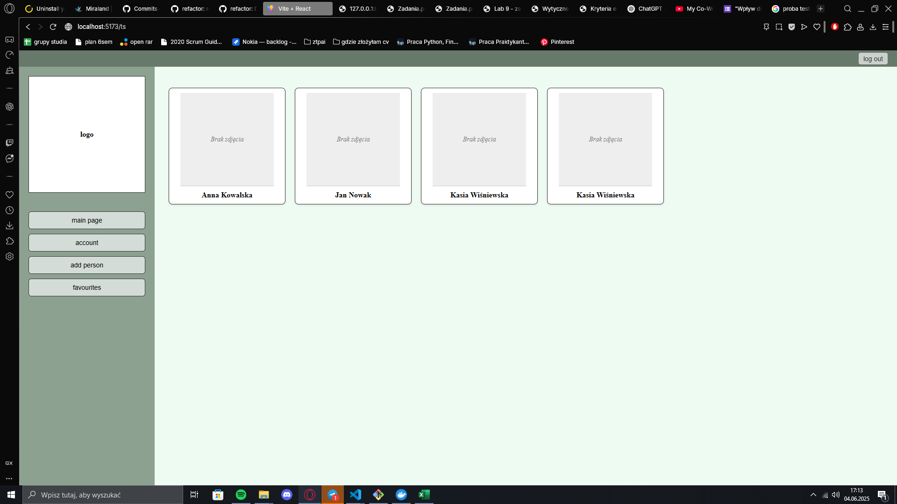
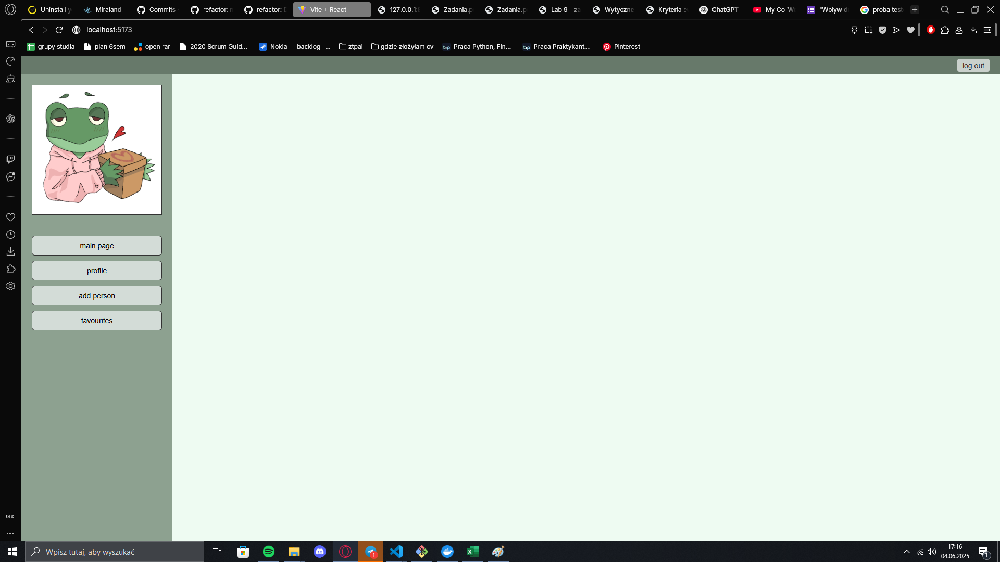
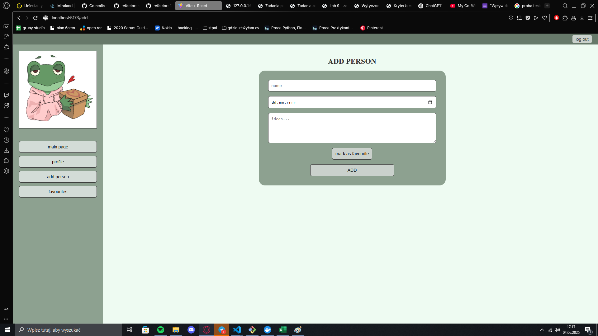
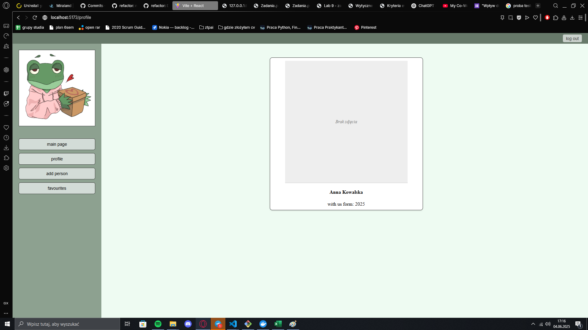
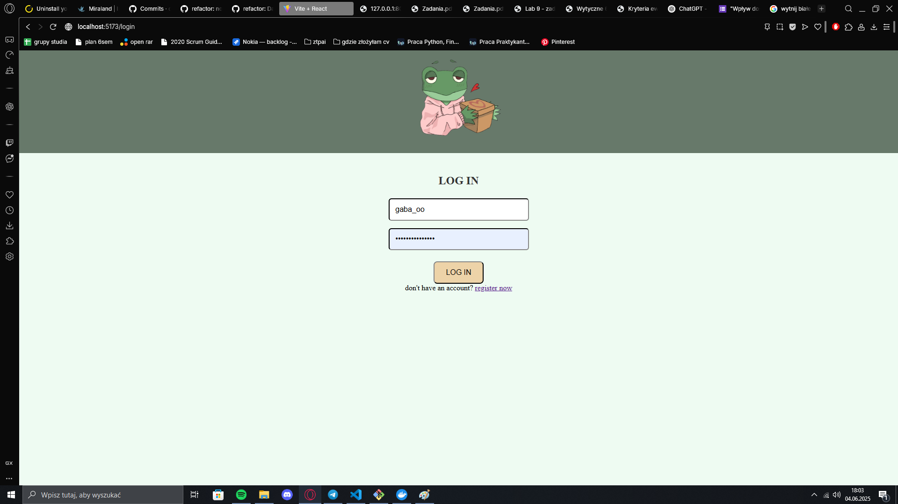
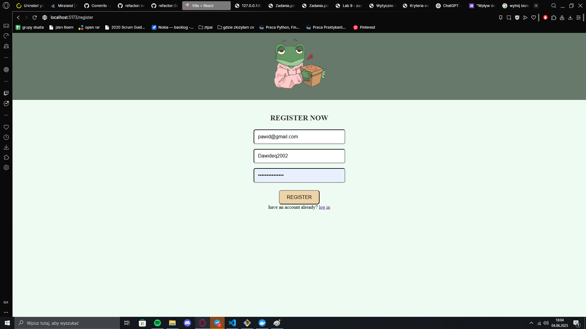

# PrezentOwO
.  
Aplikacja skierowana do osób, chcących kupić prezent bliskim. Osobiście zapisywałam takie informacje w notatniku aktualizując imiona, zainteresowania i przeróżne pomysły na prezent. Nie jest to jednak najbardziej zabezpieczony przed "podglądaniem" sposób. Aplikacja wymagająca zalogowania powinna to ułatwić.

## Architektura
Projekt podzielony jest na frontend (**React**) i backend (**Django**).

Frontend z kolei podzielony jest na /assets (dodatkowe materiały), /components (elementy typu Sidebar), /pages (właściwe podstrony) oraz pliki: App.jsx, App.css i main.jsx służące za router oraz spis stylów CSS.

Backed składa się z /api oraz /backend.

## Zrzuty ekranu z aplikacji

## Uruchomienie
Aby uruchomić należy:  

FRONTEND
1. przejść do podfolderu /frontend
2. wpisać komendę `npm run dev`  
  
*konieczne do uruchomienia: `npm install`  

BACKEND
1. przejść do podfolderu /backend
2. wpisać `\venv\Scripts\activate`
3. wpisać `docker compose up`  
  
*mogą być konieczne:  
`pip install django djangorestframework`
`django-admin startproject backend .`  (utworzy w tym samym folderze)
`pip install django-cors-headers`  (wymagane paczki)  
`pip install drf-spectacular` (swagger)

## Diagram ERD
  

## Użyte technologie
1. React 19.0.0
2. Django
3. PostgreSQL

**React, Django i PostgreSQL** to popularny i skuteczny zestaw technologiczny, ponieważ **React** umożliwia tworzenie dynamicznych i interaktywnych interfejsów użytkownika, **Django** zapewnia szybki, bezpieczny i dobrze zorganizowany backend z wbudowanym systemem uwierzytelniania, a **PostgreSQL** to wydajna i stabilna relacyjna baza danych wspierająca zaawansowane zapytania oraz skalowalność.
